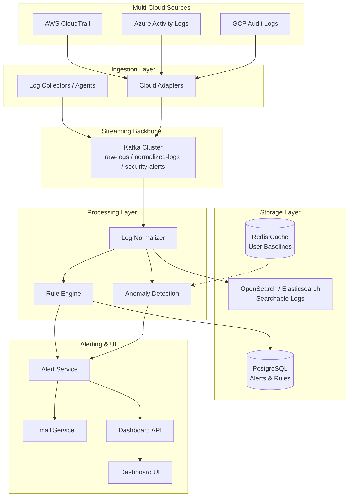

<!-- markdownlint-disable MD033 MD041 -->
<p align="center">
  
  
  
  
  
  
  
</p>

<br />
<div align="center">
  <a href="https://github.com/prompt-general/Cloud-Security-Monitoring-System">
    
  </a>

<h1 align="center">☁️ Cloud Security Monitoring System</h1>
  <p align="center">
    <strong>Real‑time threat detection across AWS, Azure & GCP</strong>
    <br />
    <i>Ingest → Normalize → Detect → Alert → Visualize</i>
    <br /><br />
    <a href="https://github.com/prompt-general/Cloud-Security-Monitoring-System"><strong>Explore the docs »</strong></a>
    <br />
    <br />
    <a href="https://github.com/prompt-general/Cloud-Security-Monitoring-System/issues">Report Bug</a>
    ·
    <a href="https://github.com/prompt-general/Cloud-Security-Monitoring-System/issues">Request Feature</a>
  </p>
</div>

<br />

## 📖 Table of Contents

<details open>
<summary>Click to expand</summary>

- [🌟 About The Project](#-about-the-project)
  - [Problem Statement](#problem-statement)
  - [Solution](#solution)
  - [Built With](#built-with)
- [✨ Features](#-features)
  - [Must Have (MVP)](#must-have-mvp)
  - [Should Have](#should-have)
  - [Future Roadmap](#future-roadmap)
- [🏗 Architecture](#-architecture)
  - [High-Level Design](#high-level-design)
  - [Data Flow](#data-flow)
  - [Tech Stack Details](#tech-stack-details)
- [🚀 Quick Start](#-quick-start)
  - [Prerequisites](#prerequisites)
  - [Installation](#installation)
  - [Configuration](#configuration)
  - [First Run](#first-run)
- [🛠 Development](#-development)
  - [Project Structure](#project-structure)
  - [Adding a New Rule](#adding-a-new-rule)
  - [Running Tests](#running-tests)
- [📊 Monitoring & Observability](#-monitoring--observability)
- [🤝 Contributing](#-contributing)
- [📝 License](#-license)
- [📞 Contact & Acknowledgments](#-contact--acknowledgments)

</details>

---

## 🌟 About The Project

### Problem Statement

Modern cloud environments generate a massive volume of authentication and activity logs across services such as IAM, APIs, and admin actions. Security threats like credential theft, unusual login behavior, and abnormal API usage often go undetected without real‑time monitoring and correlation. Security teams struggle with:

- **Log fragmentation** across AWS, Azure, and GCP
- **Delayed threat detection** (hours or days after an incident)
- **Alert fatigue** from noisy, un‑correlated notifications
- **High operational overhead** of commercial SIEM solutions

### Solution

**Cloud Security Monitoring System** is a lightweight, open‑source security monitoring platform designed for small‑scale environments (<1M logs/day) with a multi‑cloud design from day one. It provides:

✅ **Real‑time ingestion** from AWS CloudTrail, Azure Activity Logs, and GCP Audit Logs  
✅ **Unified log normalization** into a common security event schema  
✅ **Deterministic rule engine** for configurable security rules (e.g., failed login bursts, sensitive API access)  
✅ **Statistical anomaly detection** using Z‑score deviation, IP novelty, and geo‑location changes  
✅ **Email alerts** with deduplication to prevent notification spam  
✅ **Modern React dashboard** for visualizing alerts, user activity, and risk scores  

The system is built for simplicity, scalability, and extensibility – deploy it in minutes, extend it with custom rules, and scale it horizontally as your needs grow.

### Built With

| Category             | Technology                                                                                       |
| -------------------- | ------------------------------------------------------------------------------------------------ |
| **Streaming**        | Apache Kafka / Redpanda                                                                          |
| **Processing**       | Python 3.11 + FastAPI (async services)                                                           |
| **Storage – Logs**   | OpenSearch 2.11 (Elasticsearch compatible)                                                         |
| **Storage – Metadata**| PostgreSQL 15                                                                                     |
| **Storage – Cache**  | Redis 7                                                                                           |
| **Frontend**         | React 18 + TypeScript + Vite + TailwindCSS                                                        |
| **Containerization** | Docker & Docker Compose                                                                           |
| **Monitoring**       | Prometheus + Grafana                                                                              |
| **Email**            | SMTP / AWS SES / SendGrid                                                                         |

---

## ✨ Features

### Must Have (MVP)

- [x] Ingest logs from AWS, Azure, and GCP
- [x] Normalize logs into a unified schema
- [x] Detect suspicious login patterns (new IP, geo‑variation, repeated failures)
- [x] Basic anomaly detection on user activity (baseline deviation)
- [x] Real‑time or near real‑time processing (<5 min delay)
- [x] Email alert system for suspicious events
- [x] Web dashboard to view recent alerts, user activity logs, and risk scores

### Should Have

- [x] Rule‑based detection engine (configurable rules)
- [x] User identity tracking across sessions
- [x] Filtering and search in dashboard (by user, region, severity)
- [x] Alert grouping / deduplication (avoid spam alerts)

### Future Roadmap

- [ ] Role‑based access control (admin vs. viewer)
- [ ] Export logs to CSV
- [ ] Advanced threat scoring model (feedback loop)
- [ ] Slack / PagerDuty integrations
- [ ] Multi‑tenant support

---

## 🏗 Architecture

### High-Level Design

The system follows an event‑driven, microservices architecture built around a Kafka streaming backbone.



### Data Flow

1. **Ingestion** – Cloud adapters push raw logs to Kafka topic `raw-logs`.
2. **Normalization** – Service consumes `raw-logs`, transforms to unified schema, and publishes to `normalized-logs`.
3. **Detection** – Two parallel consumers read from `normalized-logs`:
   - **Rule Engine** – evaluates deterministic rules (e.g., failed login burst, sensitive API access).
   - **Anomaly Detection** – computes behavior scores using Redis baselines.
4. **Alerting** – Both services push alerts to `security-alerts` topic.
5. **Notification** – Alerting service consumes `security-alerts`, deduplicates, stores in PostgreSQL, and sends email.
6. **Visualization** – React dashboard queries PostgreSQL and OpenSearch via the API gateway.

### Tech Stack Details

| Service                | Tech Stack                               | Port (internal) | Key Responsibilities                              |
| ---------------------- | ---------------------------------------- | --------------- | ------------------------------------------------- |
| **Ingestion**          | Python + confluent‑kafka                 | -               | Poll cloud logs, produce raw logs to Kafka        |
| **Normalization**      | Python + opensearch‑py                   | -               | Transform logs to unified schema, index to OS     |
| **Rule Engine**        | Python + PostgreSQL                      | -               | Evaluate security rules, produce alerts           |
| **Anomaly Detection**  | Python + Redis                           | 8001 (metrics)  | User baselines, Z‑score anomaly, IP/geo novelty   |
| **Alerting**           | Python + SMTP + PostgreSQL               | -               | Deduplicate, store, email                         |
| **API Gateway**        | FastAPI + JWT + asyncpg                  | 8000            | REST endpoints, auth, aggregation                 |
| **Frontend**           | React + Vite + TailwindCSS + Axios       | 3000            | Dashboard UI, real‑time updates                   |
| **Kafka**              | Apache Kafka / Redpanda (+ Zookeeper)    | 9092            | Event streaming backbone                          |
| **PostgreSQL**         | PostgreSQL 15                            | 5432            | Alerts, rules, user metadata                      |
| **Redis**              | Redis 7                                  | 6379            | Real‑time baselines, session cache, deduplication |
| **OpenSearch**         | OpenSearch 2.11 + Dashboards             | 9200 / 5601     | Log storage and search                            |
| **Prometheus**         | Prometheus 2.47                          | 9090            | Metrics aggregation                               |
| **Grafana**            | Grafana 10.2                             | 3001            | Dashboards & visualization                        |

---

## 🚀 Quick Start

### Prerequisites

- Docker & Docker Compose (v2.0+)
- Git
- 8GB+ RAM (recommended for full stack)
- Optional: SMTP credentials for email alerts

### Installation

```bash
# Clone the repository
git clone https://github.com/prompt-general/Cloud-Security-Monitoring-System.git
cd Cloud-Security-Monitoring-System

# Copy environment configuration
cp .env.example .env

# Start all services
cd infra
docker-compose up -d

# Verify all containers are running
docker-compose ps
```

### Configuration

#### Email Alerts (Optional)

Edit `.env` file:

```env
SMTP_HOST=smtp.gmail.com
SMTP_PORT=587
SMTP_USER=your-email@gmail.com
SMTP_PASSWORD=your-app-password
ALERT_RECIPIENT=admin@example.com
```

#### Cloud Provider Integration (Optional)

Uncomment and configure the appropriate adapter in `backend/services/ingestion-service/cloud_adapters/`:

- **AWS** – set `AWS_ACCESS_KEY_ID`, `AWS_SECRET_ACCESS_KEY`, `AWS_REGION`
- **Azure** – set `AZURE_CONNECTION_STRING`, `EVENT_HUB_NAME`
- **GCP** – set `GOOGLE_APPLICATION_CREDENTIALS` path

> For development, the system includes mock adapters that generate simulated logs automatically.

### First Run

Once all containers are up, access the services:

| Service                | URL                        | Credentials               |
| ---------------------- | -------------------------- | ------------------------- |
| **Dashboard UI**       | http://localhost:3000      | (no auth in MVP)          |
| **API Gateway Docs**   | http://localhost:8000/docs | Swagger UI                |
| **Kafka UI**           | http://localhost:8080      | -                         |
| **OpenSearch Dashboards** | http://localhost:5601   | -                         |
| **Grafana**            | http://localhost:3001      | admin / admin             |
| **Prometheus**         | http://localhost:9090      | -                         |

#### Test the pipeline with sample logs:

```bash
# Send a sample raw log
docker exec -it cloudsec-kafka kafka-console-producer \
  --broker-list localhost:9092 \
  --topic raw-logs

# Paste this JSON (press Enter, then Ctrl+C):
{"source":"aws.cloudtrail","timestamp":"2026-04-28T10:00:00Z","user":"test@example.com","ip":"1.2.3.4","event_type":"Login","status":"Failure","resource":"arn:aws:ec2:us-east-1:123456789012:instance/i-12345"}

# Check if an alert was generated (repeat 5+ times for same user to trigger burst rule)
docker exec cloudsec-kafka kafka-console-consumer \
  --bootstrap-server localhost:9092 \
  --topic security-alerts \
  --from-beginning
```

#### Verify data in the dashboard:

1. Open http://localhost:3000
2. You should see the alert in the `AlertTable`
3. Click on a user to view their activity timeline

---

## 🛠 Development

### Project Structure

```
.
├── backend/
│   ├── services/                # Microservices
│   │   ├── ingestion-service/   # Cloud log collectors
│   │   ├── normalization-service/# Schema transformer
│   │   ├── rule-engine-service/ # Deterministic rules
│   │   ├── anomaly-service/     # Statistical anomaly detection
│   │   ├── alerting-service/    # Email & storage
│   │   └── api-gateway/         # FastAPI backend
│   └── shared/                  # Common schemas & utils
├── frontend/                    # React dashboard
│   ├── src/
│   │   ├── components/          # AlertTable, Timeline, Filters
│   │   ├── pages/               # Dashboard, Login
│   │   └── services/            # API client
│   └── public/
├── infra/                       # Docker & orchestration
│   ├── docker-compose.yml
│   ├── prometheus/
│   └── grafana/
├── scripts/                     # Load testing & utilities
└── docs/                        # Additional documentation
```

### Adding a New Rule

1. Navigate to `backend/services/rule-engine-service/rules/`
2. Create a new file or add a function in `base_rules.py`:

```python
def evaluate_sensitive_resource_access(event: dict) -> bool:
    """Alert when a user accesses an IAM or security-critical resource."""
    sensitive_keywords = ["iam", "security", "policy", "credential"]
    resource = event.get("resource", "").lower()
    return any(keyword in resource for keyword in sensitive_keywords)
```

3. Register the rule in `app.py`:

```python
if evaluate_sensitive_resource_access(event):
    alert = create_alert(event, "Sensitive resource accessed", 0.75, "SensitiveResource")
    alerts.append(alert)
```

4. Rebuild and restart the rule engine service:

```bash
cd infra
docker-compose up -d --build rule-engine-service
```

### Running Tests

```bash
# Backend unit tests (each service)
cd backend/services/rule-engine-service
python -m pytest tests/

# Frontend tests
cd frontend
npm test

# End-to-end pipeline test
bash scripts/test_pipeline.sh
```

> **Note**: Comprehensive test suites are under active development. Contributions are welcome!

---

## 📊 Monitoring & Observability

The system exposes Prometheus metrics from each microservice:

| Metric                         | Type      | Description                         |
| ------------------------------ | --------- | ----------------------------------- |
| `ingestion_raw_logs_total`     | Counter   | Total raw logs ingested per cloud   |
| `normalization_errors_total`   | Counter   | Failed transformations              |
| `rule_evaluations_total`       | Counter   | Rule evaluations (triggered/not)    |
| `anomaly_alerts_total`         | Counter   | Alerts from anomaly detection       |
| `alerting_emails_sent_total`   | Counter   | Email notifications sent            |
| `anomaly_scores`               | Histogram | Distribution of anomaly scores      |

Access Grafana at http://localhost:3001 (admin/admin) to view pre‑configured dashboards.

---

## 🤝 Contributing

Contributions are what make the open‑source community such an amazing place to learn, inspire, and create. Any contributions you make are **greatly appreciated**.

1. **Fork** the Project
2. **Create your Feature Branch** (`git checkout -b feature/AmazingFeature`)
3. **Commit your Changes** (`git commit -m 'Add some AmazingFeature'`)
4. **Push to the Branch** (`git push origin feature/AmazingFeature`)
5. **Open a Pull Request**

See `CONTRIBUTING.md` for detailed guidelines.

### Development Priorities

- ✅ Core pipeline & infrastructure
- ✅ Basic rules & anomaly detection
- ✅ Dashboard MVP
- 🔄 Comprehensive test coverage
- 🔄 Documentation improvements
- ⏳ RBAC & multi‑tenancy
- ⏳ Advanced ML detection models

---

## 📝 License

Distributed under the MIT License. See `LICENSE` for more information.

---

## 📞 Contact & Acknowledgments

**Project Link**: [https://github.com/prompt-general/Cloud-Security-Monitoring-System](https://github.com/prompt-general/Cloud-Security-Monitoring-System)

### Acknowledgments

- [Apache Kafka](https://kafka.apache.org/) – distributed event streaming
- [OpenSearch](https://opensearch.org/) – search & analytics engine
- [FastAPI](https://fastapi.tiangolo.com/) – modern Python web framework
- [React](https://reactjs.org/) – UI library
- [TailwindCSS](https://tailwindcss.com/) – utility‑first CSS
- [Prometheus](https://prometheus.io/) & [Grafana](https://grafana.com/) – monitoring stack

---

<p align="center">
  Made with ☁️ & ❤️ by the Cloud Security Community
</p>
